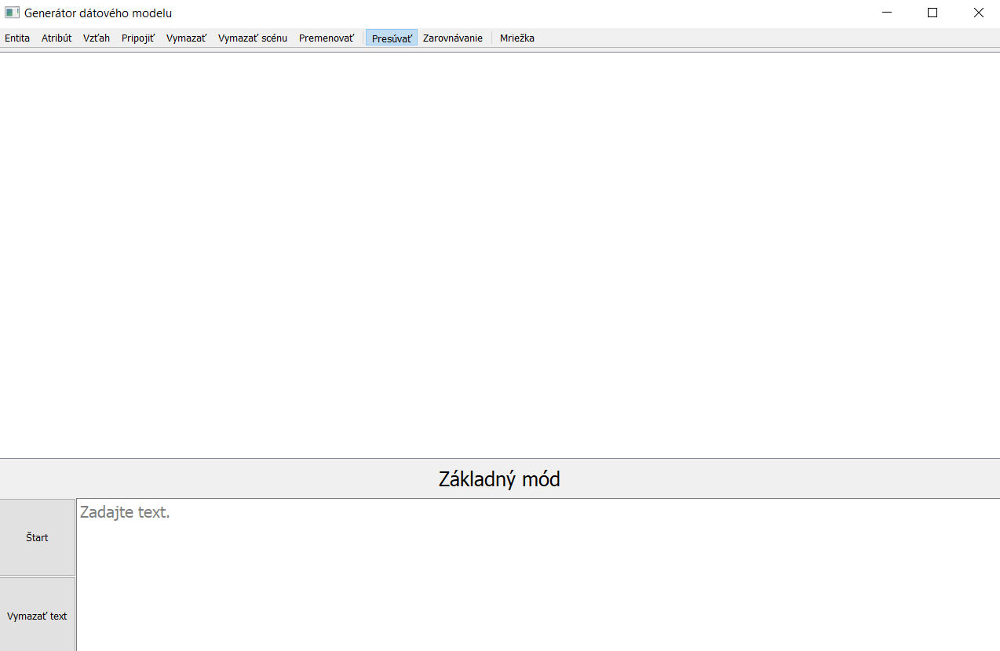
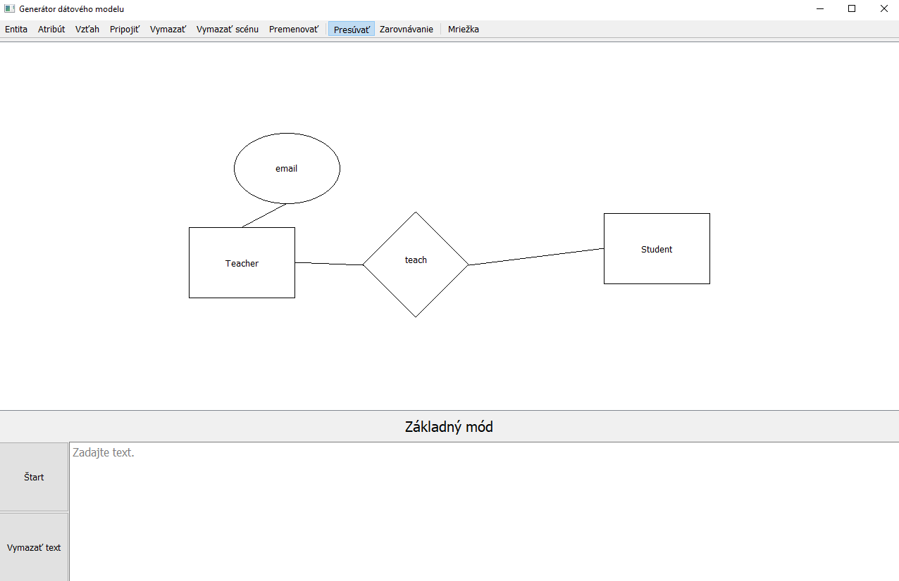
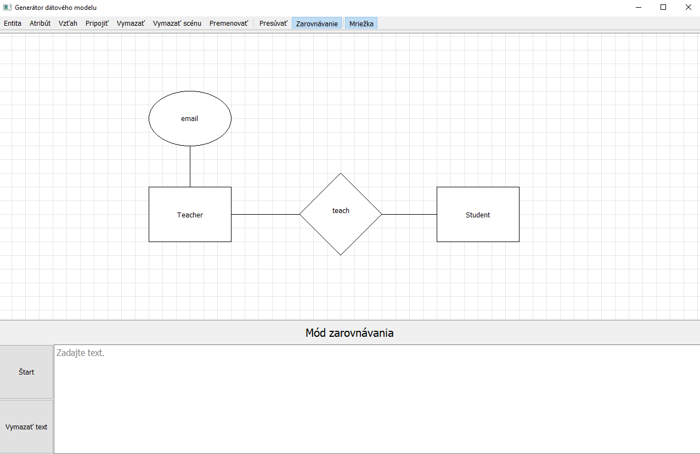
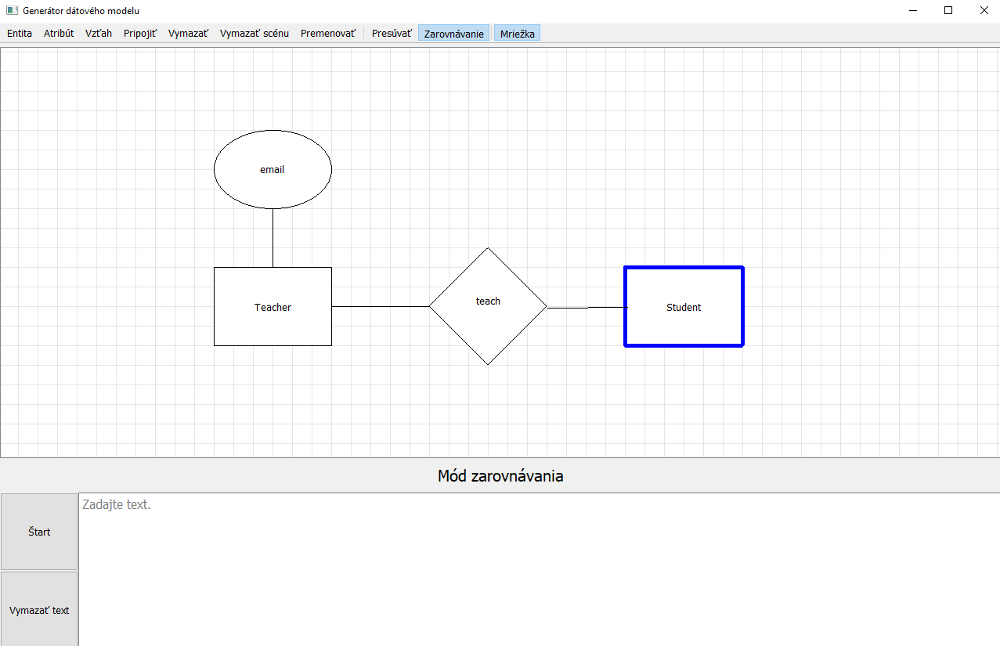

# DATA MODEL GRAPHICAL USER INTERFACE

### Overview

The Data Model Designer is a graphical user interface (GUI)
tool that allows users to create and visualize data models.
It simplifies the process of defining entities, relationships,
and attributes, making it easier to design and understand your data structures.

GUI was created for bachelor thesis. It contains text field used for describing the data model
in natural language. Application then creates data model according to the description. This repository 
contains only code for GUI.

### Features

* Create, deleting and manage entities, attributes and relationships.
* Creating connections between entities attributes and relationships.
* Aligning components in data model. Aligning along gridlines.

### Installation

1. Clone repository
```commandline
git clone git@github.com:simonkrupa/data-model-gui.git
```

1. Setup virtual environment (optional)
```commandline
python3 -m venv venv
source venv/bin/activate  # On Windows, use: venv\Scripts\activate
```

3. Install dependencies
```commandline
pip install -r requirements.txt
```

4. Run application
```commandline
python main.py
```

### Images







Dragging and aligning entity object
